# AI/ML Learning Roadmap

This repository documents my journey learning artificial intelligence and machine learning, following a structured curriculum that progresses from traditional AI through modern deep learning and generative AI systems.

# Overview

```mermaid
flowchart LR
    %% Style definitions with enhanced contrast
    classDef aiClass fill:#E6F3FF,stroke:#2B6CB0,stroke-width:2px,color:#1A365D
    classDef mlClass fill:#E6FFE6,stroke:#2F855A,stroke-width:2px,color:#1C4532
    classDef dlClass fill:#C6F6D5,stroke:#276749,stroke-width:2px,color:#1C4532
    classDef genClass fill:#FED7E2,stroke:#97266D,stroke-width:2px,color:#521B41
    classDef traditionalClass fill:#F7FAFC,stroke:#4A5568,stroke-width:2px,color:#1A202C
    classDef applicationClass fill:#FFFFFF,stroke:#4A5568,stroke-width:1px,color:#1A202C
    classDef focusClass stroke:#FF0000,stroke-width:4px

    %% Main AI node
    AI[("Artificial Intelligence 🧠")]

    %% Primary branches
    TRAD["Traditional AI"]
    ML["Machine Learning ⚙️"]
    DL["Deep Learning 🔄"]
    GEN["Generative AI 💡"]

    %% Traditional AI components
    subgraph Traditional["Traditional Approaches"]
        direction TB
        TRAD1["Rule-Based Systems"]
        TRAD2["Expert Systems"]
        TRAD3["Symbolic AI"]
        TRAD4["Search Algorithms"]
        TRAD5["Knowledge Representation"]
    end

    %% Machine Learning components
    subgraph MLTypes["Machine Learning Types"]
        direction TB
        ML1["Supervised Learning<br>(Scikit-learn)"]
        ML2["Unsupervised Learning"]
        ML3["Reinforcement Learning"]
        ML4["Ensemble Learning"]
    end

    subgraph MLEval["Model Evaluation"]
        direction TB
        ME1["Performance Metrics<br>(Accuracy, Precision, Recall, F1)"]
        ME2["Bias-Variance Tradeoff"]
        ME3["Hyperparameter Tuning"]
    end

    %% Deep Learning components
    subgraph DLTypes["Deep Learning Architecture"]
        direction TB
        DL1["Convolutional Neural Networks"]
        DL2["Recurrent Neural Networks"]
        DL3["Transformer Networks"]
        DL4["GANs"]
    end

    subgraph DLComp["Deep Learning Components"]
        direction TB
        DC1["Activation Functions<br>(ReLU, Sigmoid, Tanh)"]
        DC2["Loss Functions<br>(MSE, Cross-Entropy)"]
        DC3["Optimization Algorithms<br>(SGD, Adam, RMSprop)"]
    end

    %% Generative AI components
    subgraph GENTypes["Generative Models"]
        direction TB
        GEN1["Large Language Models<br>(PyTorch, Transformers)"]
        GEN2["Diffusion Models"]
        GEN3["VAEs"]
    end

    subgraph GenComp["Generative AI Components"]
        direction TB
        GC1["Prompt Engineering"]
        GC2["Fine-tuning"]
        GC3["Evaluation Metrics"]
    end

    %% MLOps and Leadership
    subgraph MLOps["MLOps & Infrastructure"]
        direction TB
        MO1["Docker/Kubernetes"]
        MO2["Cloud Platforms<br>(AWS SageMaker, GCP, Azure)"]
        MO3["Model Serving<br>(REST APIs, TF Serving, TorchServe)"]
        MO4["Feature Stores<br>(Feast)"]
        MO5["Workflow Orchestration<br>(Airflow, Kubeflow)"]
        MO6["Model Versioning/Tracking<br>(MLflow, DVC)"]
        MO7["Monitoring & Observability"]
    end
    
    subgraph Leadership["Leadership & Specialization"]
        direction TB
        LS1["Team Management & Mentorship"]
        LS2["Technical Strategy & Vision"]
        LS3["Communication & Collaboration"]
        LS4["MLOps & LLMs"]
    end

    %% Core relationships
    AI --> TRAD & ML
    ML --> DL
    DL --> GEN

    %% Component relationships
    TRAD --> Traditional
    ML --> MLTypes
    ML --> MLEval
    DL --> DLTypes
    DL --> DLComp
    GEN --> GENTypes
    GEN --> GenComp

    %% Cross-component relationships
    DL3 --> GEN1
    ML3 -.-> DL2
    TRAD3 -.-> ML1
    DLTypes --> DL4

    %% Examples
    ML_Ex[/"Examples:
    - Spam filters
    - Recommendation systems"/]
    DL_Ex[/"Examples:
    - Image recognition
    - Self-driving cars
    - Speech recognition"/]
    GEN_Ex[/"Examples:
    - ChatGPT
    - DALL-E 2
    - Bard
    - Code generation"/]

    MLTypes -.-> ML_Ex
    DLTypes -.-> DL_Ex
    GENTypes -.-> GEN_Ex

    %% Apply styles
    class AI aiClass
    class ML,ML1,ML2,ML3,ML4,ME1,ME2,ME3 mlClass
    class DL,DL1,DL2,DL3,DL4,DC1,DC2,DC3 dlClass
    class GEN,GEN1,GEN2,GEN3,GC1,GC2,GC3 genClass
    class TRAD,TRAD1,TRAD2,TRAD3,TRAD4,TRAD5 traditionalClass
    class ML_Ex,DL_Ex,GEN_Ex applicationClass
    class MLOps,Leadership focusClass

    %% Connect to MLOps and Leadership
    ML --> MLOps
    DL --> MLOps
    GEN --> MLOps
    ML --> Leadership
    DL --> Leadership
    GEN --> Leadership
```

This diagram illustrates the relationships between different branches of AI, from traditional approaches through modern deep learning and generative AI systems.

TODO - Create live Miro version

## Repository Organization

Learning materials are organized to support progressive understanding:

### Learning Path Structure

The `notebooks` directory contains our core learning materials, organized by topic:
- `algorithms`: Deep dives into fundamental ML algorithms
- `deep_learning`: Neural networks and advanced architectures
- `machine_learning_basics`: Foundation concepts in ML
  - `supervised`: Understanding supervised learning approaches
  - `unsupervised`: Exploring unsupervised techniques
  - `reinforcement`: Introduction to reinforcement learning

Each notebook focuses on clear examples and practical implementation.

### Project Implementation

The `projects` directory contains real-world applications that put our learning into practice:
- `supervised`: Applications using supervised learning techniques
  - `text_classification`: A complete text classification system
- `unsupervised`: Projects exploring unsupervised approaches
- `generative_ai`: Experiments with generative models

Each project includes its own documentation and setup instructions.

### Documentation Structure

The `docs` directory contains detailed notes and reference materials:
- `diagrams`: Visual explanations of concepts
- `notes`: In-depth exploration of ML topics
  - `supervised.md`: Complete guide to supervised learning
  - `unsupervised.md`: Understanding unsupervised approaches
  - `types.md`: Overview of ML categories
  - `reinforcement.md`: Guide to reinforcement learning

### Supporting Components
- `data`: Dataset storage and processing
- `frameworks`: Framework-specific implementations
- `src`: Shared utilities and helper functions
- `tests`: Testing infrastructure

## Getting Started

1. Begin with the documentation in `docs/notes` to build theoretical understanding
2. Work through notebooks in sequence to gain hands-on experience
3. Explore project implementations to see real-world applications
4. Contribute to existing projects or start new ones

## Core Reference Materials

We maintain several key reference documents:
- `algorithms.md`: Comprehensive catalog of ML algorithms
- `tools.md`: Overview of our technology stack
-  Reading the relevant documentation in `docs/notes`
- Project-specific READMEs: Detailed setup and usage instructions

## Future Development

We continuously expand this repository with:
- New algorithm implementations
- Additional practical projects
- Enhanced documentation
- Integration of emerging tools and frameworks

# Contributing

TODO
