# Man vs Machine Learning

What happens when humans and machines learn in parallel? As a software engineer diving into AI, I'm discovering surprising parallels between the two—and what they mean for the future.

## The Race to the Bottom

The more I explore LLMs and AI, the more I notice something that ties into what I've heard phrased as a "race to the bottom." When I first heard that term, it sounded negative, but the reality I'm discovering is more nuanced. It's what happens when these models gain access to the same foundational knowledge—they start converging in ways that normalize results. It's like when you search YouTube for how to code something—different teachers explain it in their own way, but the core information is the same. Cooking recipes are another example. The real difference comes down to how it's delivered, and even popularity depends on how well the information resonates with certain groups who learn and process information in their own unique ways.

There's also variance built into these models—like adjusting temperature for randomness and creativity. For now, I think humans still win here, but it's wild that we can even bake creativity into a model.

So, what does "race to the bottom" mean here? Some companies will always have advantages with their proprietary data—that's their edge. But with so much open-source information out there (historical data, public stats, market trends, the INTERNET), most models are working from the same foundational knowledge. They'll likely converge in many areas, standing out only in domains where unique data or specialized training gives them an edge.

That made me reflect on learning in this context. If models are becoming more alike in base capabilities, maybe the real value isn't just having information but knowing how to use it, combine it, and build with it. It's like how knowing syntax alone doesn't make you a good engineer—you need to understand systems, patterns, and how to solve real problems.

## Learning Types: Machines and Me

This got me thinking about learning in an AI world. As a software engineer stepping into AI/ML, I've noticed connections between how machines learn and how I learn. I'm a visual and hands-on learner—diagrams help me understand systems, and real practice is what makes things click.

At work, this translates directly into how I process information. When faced with complex systems or intricate processes, my instinct is to open Miro or FigJam and start mapping. I'll take what someone's explaining verbally—a system they've already built or a process they're developing—and translate it into a visual flow. People sometimes try to give me credit for clarifying things, but I always tell them the truth: I'm not creating new knowledge; I'm just translating their expertise into a visual language that makes sense to people like me. It's about bridging the gap between different ways of understanding.

When I look at basic machine learning types, they remind me of different ways people learn:

- **Supervised learning**: Like starting with labeled data—someone guiding you step by step. Whether it's earning a college degree or working through Jon Calhoun's Go course, the pattern is the same: structured guidance, clear feedback loops, and a path laid out before you. Both gave me solid foundations, just through different lenses—academic theory versus practical application.

- **Unsupervised learning**: This is more like being handed the docs and figuring things out for yourself—unlabeled data for machines. It hits home when I dive into a new codebase. Nobody's pointing out patterns, so I'm connecting the dots myself. Those "aha!" moments come when I actually run the app, log outputs, or break the code so I can debug it.

## The Bootstrap Problem

One thing I've realized—you need enough baseline knowledge to even get started. I call this the bootstrap problem. As a software engineer, I can look at ML code, and even if I don't know Python well, I get the structure enough to know what questions to ask. That baseline opens the door to deeper learning—or at least gives you a head start.

This isn't just a theory—I've seen it in action. Recently, I looked at some ML code for a plant compatibility analyzer. Even though I didn't know Python well, my software background helped me recognize patterns and ask questions like, "How do we test ML outputs?" and "How do we handle variability in the results?" These aren't random questions—they're shaped by experience.

**Reinforcement learning** ties this idea together for me. I saw it during a recent hackathon where I was building a Favorites feature fullstack but the backend was in Elixir. I'm not an Elixir dev, but my experience in other languages gave me enough foundation to start. Sure, I hit every possible error (that's my superpower), but my understanding of programming concepts helped me debug and learn. I wasn't just copying solutions from AI, I made efforts to understand recommendations and foundational concepts to phoneix, elixir, and ecto. At times I was able to correct hallucinations and make improvements, as well as follow pre-existing patterns specifcally for our codebase. Context is key; it gives you a place to build from.

The learning curve was real. I spent the first three days constantly looking up syntax, but by day four, I was mostly self-reliant. By the end, I had a working demo that was "hackathon production ready"—or, in *estimation terms, two sprints+ away* from being ready to ship. 😅 This whole experience proved that a strong technical foundation lets you learn efficiently, even with AI tools. You still need that baseline understanding to ask the right questions and make sense of the answers.

## Tools and Knowledge: A Two-Way Street

This all circles back to what's valuable in the AI landscape. Sure, AI models might all end up with similar knowledge, and you can find tutorials for just about anything—or at this point, create your own tutorials. But there's a beautiful spectrum between using tools and building them—and both sides matter. I'm a builder at heart—I build products. That means understanding how things work under the hood, not just how to use them. But I've also know that using tools effectively is its own skill, one that often leads to deeper insights about how to build better ones.

Think about it like learning music. Some people become amazing musicians without ever building instruments, while others craft instruments but barely play. The magic happens when you understand both sides—when your experience using tools informs how you build them, and your knowledge of building helps you use them more effectively.

Right now, I'm diving into ML types through Coursera, and I find myself constantly thinking about potential projects—like that plant compatibility analyzer. Each step forward reveals new possibilities, new challenges, and new opportunities to grow. Whether you're using AI tools to solve problems or building new ones from scratch, there's value in both paths.

I'll continue to think about how to learn and what's useful on my path to AI competence. Starting with a foundation and building from it while relating practical knowledge to technical ideas mirrors the very learning patterns we see in ML—layering understanding upon understanding, making connections, finding patterns.

> You can just learn things! No one is stopping you—so why not start now?
