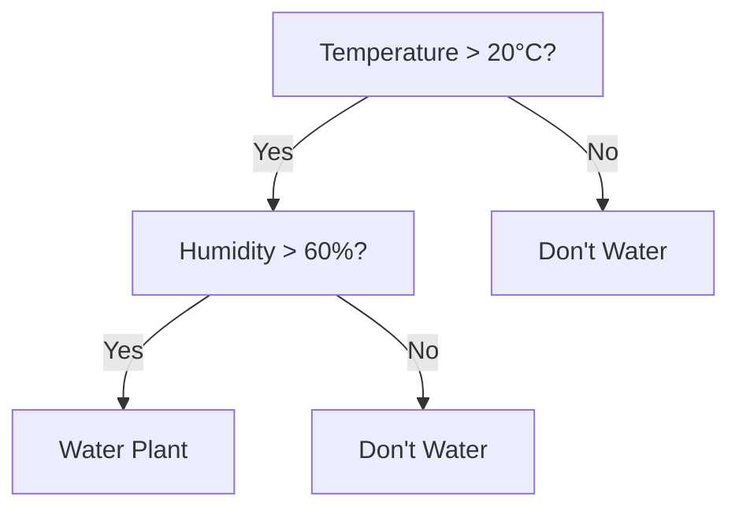

# Understanding Supervised Learning

Supervised learning represents one of the fundamental approaches in machine learning, where a model learns from labeled examples to make predictions about new, unseen data. Think of it as learning with a teacher - for each example in our training data, we know the correct answer, and the model learns to predict these answers.

## Core Concepts

### The Learning Process

Supervised learning works by finding patterns in data. When we train a model, we're essentially teaching it to recognize relationships between inputs (features) and outputs (labels). This process involves:

1. Data Preparation: Converting raw data into a format our model can understand
2. Training: Showing the model examples and adjusting its parameters
3. Validation: Testing the model's performance on unseen data
4. Iteration: Refining the model based on its performance

### Types of Supervised Learning Problems

#### Classification
In classification problems, we predict discrete categories or classes. The model learns decision boundaries that separate different classes in the feature space. Common examples include:

- Binary Classification: Two possible outcomes (e.g., spam vs. not spam)
- Multiclass Classification: Multiple possible categories (e.g., plant species identification)
- Multilabel Classification: Multiple labels can be true simultaneously

```python
# Example of a simple classification problem
from sklearn.ensemble import RandomForestClassifier

def train_classifier(X_train, y_train):
    """
    Train a random forest classifier on the input data.
    X_train: Feature matrix
    y_train: Target labels
    """
    classifier = RandomForestClassifier(n_estimators=100)
    classifier.fit(X_train, y_train)
    return classifier
```

#### Regression
Regression problems involve predicting continuous numerical values. The model learns to approximate a function that maps inputs to outputs. Examples include:

- Linear Regression: Predicting values using linear relationships
- Polynomial Regression: Capturing non-linear patterns
- Multiple Regression: Using multiple input features

```python
# Example of a regression problem
from sklearn.linear_model import LinearRegression
import numpy as np

def train_regressor(X_train, y_train):
    """
    Train a linear regression model on the input data.
    X_train: Feature matrix
    y_train: Continuous target values
    """
    regressor = LinearRegression()
    regressor.fit(X_train, y_train)
    return regressor
```

## Core Algorithms

### Classification Algorithms

#### Decision Trees
Decision trees make predictions by following a series of rules, splitting the data based on feature values. They're intuitive and can handle both numerical and categorical data.



#### Random Forests
Random forests combine multiple decision trees to make more robust predictions. Each tree sees a different subset of the data and features, and their predictions are combined through voting or averaging.

#### Support Vector Machines (SVM)
SVMs find the optimal hyperplane that separates different classes. They're particularly effective for high-dimensional data and can handle non-linear classification using kernel functions.

### Regression Algorithms

#### Linear Regression
The foundation of regression analysis, linear regression models the relationship between variables using a linear equation. It's simple but powerful for understanding relationships in data.

```python
# Implementing simple linear regression
def linear_regression(X, y):
    """
    Implement linear regression from scratch.
    Returns coefficients and intercept.
    """
    X_mean = np.mean(X)
    y_mean = np.mean(y)
    
    numerator = sum((X - X_mean) * (y - y_mean))
    denominator = sum((X - X_mean) ** 2)
    
    slope = numerator / denominator
    intercept = y_mean - slope * X_mean
    
    return slope, intercept
```

#### Polynomial Regression
When relationships aren't linear, polynomial regression can capture more complex patterns by including polynomial terms of the input features.

## Model Evaluation

### Metrics for Classification
Understanding model performance requires appropriate metrics:

- Accuracy: Overall correct predictions
- Precision: Accuracy of positive predictions
- Recall: Ability to find all positive cases
- F1 Score: Harmonic mean of precision and recall

### Metrics for Regression
Regression models use different metrics:

- Mean Squared Error (MSE)
- Root Mean Squared Error (RMSE)
- Mean Absolute Error (MAE)
- R-squared (R²) Score

```python
def calculate_metrics(y_true, y_pred):
    """
    Calculate common regression metrics.
    """
    mse = np.mean((y_true - y_pred) ** 2)
    rmse = np.sqrt(mse)
    mae = np.mean(np.abs(y_true - y_pred))
    
    # Calculate R-squared
    ss_total = np.sum((y_true - np.mean(y_true)) ** 2)
    ss_residual = np.sum((y_true - y_pred) ** 2)
    r2 = 1 - (ss_residual / ss_total)
    
    return {
        'mse': mse,
        'rmse': rmse,
        'mae': mae,
        'r2': r2
    }
```

## Common Challenges and Solutions

### Overfitting
When models learn the training data too well, they may fail to generalize. Solutions include:

- Cross-validation
- Regularization
- Ensemble methods

### Feature Selection
Choosing the right features is crucial. Techniques include:

- Forward selection
- Backward elimination
- Regularization methods (Lasso, Ridge)

### Imbalanced Data
When classes aren't equally represented, consider:

- Oversampling minority classes
- Undersampling majority classes
- Synthetic data generation (SMOTE)

## Practical Implementation

When implementing supervised learning solutions:

1. Start with data exploration and preprocessing
2. Choose appropriate algorithms based on the problem
3. Implement robust validation procedures
4. Monitor model performance over time

```python
class SupervisedLearningPipeline:
    def __init__(self, model_type='classification'):
        self.model_type = model_type
        self.model = None
        self.scaler = None
    
    def preprocess_data(self, X):
        """
        Preprocess input features.
        """
        if self.scaler is None:
            self.scaler = StandardScaler()
            return self.scaler.fit_transform(X)
        return self.scaler.transform(X)
    
    def train(self, X, y):
        """
        Train the model with appropriate preprocessing.
        """
        X_processed = self.preprocess_data(X)
        if self.model_type == 'classification':
            self.model = RandomForestClassifier()
        else:
            self.model = LinearRegression()
        
        self.model.fit(X_processed, y)
    
    def predict(self, X):
        """
        Make predictions on new data.
        """
        X_processed = self.preprocess_data(X)
        return self.model.predict(X_processed)
```
