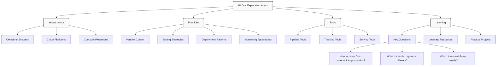

# MLOps Exploration

## What is MLOps?
MLOps represents the intersection of machine learning, operations, and software engineering. This section documents my journey in understanding how to take machine learning models from experimentation to real-world applications.

## Key Areas to Explore

### Infrastructure Questions
- Container systems (Docker, Kubernetes)
- Cloud platform options
- Computing resource management
- Data pipeline architecture

### Core Practices to Learn
- Version control for models and data
- Testing approaches for ML systems
- Deployment patterns
- Monitoring strategies

### Tools to Investigate
- Pipeline orchestration tools
- Model and experiment tracking
- Model serving frameworks
- Feature stores

## Learning Approach
Rather than following a prescribed path, this section will evolve as I:
- Document challenges encountered when deploying models
- Explore different tools and approaches
- Build small proof-of-concept projects
- Learn from both successes and failures

## Current Questions
- How do ML systems differ from traditional software?
- What makes a ML system "production-ready"?
- Which tools match different project needs?
- How to balance complexity with maintainability?

## Resources and References
This section will grow with useful resources, articles, and lessons learned during the learning journey.

## Projects
Future projects will be documented here as I experiment with different MLOps approaches.

