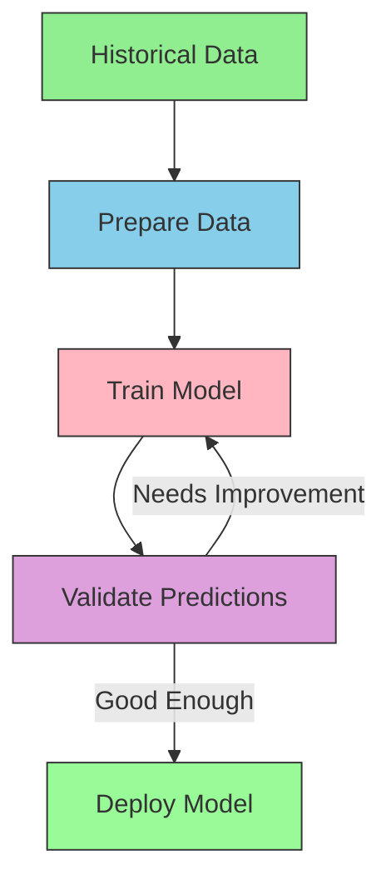

# Understanding Supervised Learning

Supervised learning helps us make predictions using data we've already labeled. This guide explores how supervised learning works using examples from plant care—an area where predictions can be easily tested and validated.

## The Core Ideas Explained

Imagine you're starting to track conditions in your garden. Over time, you collect data about temperature, sunlight, and water, and you note how your plants respond. You begin to notice patterns—certain combinations of conditions lead to better growth. Supervised learning works the same way, recognizing complex patterns across many variables that would be difficult to track manually.

### Essential Building Blocks

Let's break down the key concepts using real examples:

**Features - The Information We Use to Make Predictions**
- In plant care: soil moisture, light levels, temperature, humidity

**Labels - What We Are Trying to Predict**
- Plant health status or expected growth rate

Here's how we might structure plant monitoring data:

```python
import pandas as pd
from sklearn.model_selection import train_test_split

def prepare_plant_data(measurements):
    """
    Prepares plant monitoring data for analysis.
    
    Args:
        measurements: DataFrame with columns like:
            - soil_moisture: Daily moisture readings
            - light_level: Hours of direct sunlight
            - temperature: Average daily temperature
            - growth_rate: Measured growth (our prediction target)
    """
    features = measurements[[
        'soil_moisture',
        'light_level',
        'temperature'
    ]].copy()
    
    labels = measurements['growth_rate']
    
    return features, labels
```

### Learning Process Visualization



### Common Challenges and Solutions

**Overfitting** happens when our model learns patterns that are too specific. For example:
- Plant care: Learning that plants only grow well on specific days instead of generalizing conditions

**Underfitting** occurs when our model misses important patterns:
- Plant care: Ignoring light conditions while focusing solely on watering

## Implementation Guide

Let's build a practical example that predicts plant growth:

```python
from sklearn.ensemble import RandomForestRegressor
from sklearn.metrics import mean_squared_error
import numpy as np

class PlantGrowthPredictor:
    def __init__(self):
        self.model = RandomForestRegressor(
            n_estimators=100,
            random_state=42
        )
        self.feature_names = [
            'soil_moisture',
            'light_level',
            'temperature',
            'humidity'
        ]
    
    def train(self, plant_data):
        """
        Trains the growth prediction model using historical data.
        
        Args:
            plant_data: DataFrame with plant measurements and growth rates
        """
        # Prepare features and labels
        X = plant_data[self.feature_names]
        y = plant_data['growth_rate']
        
        # Split data for training and validation
        X_train, X_val, y_train, y_val = train_test_split(
            X, y, test_size=0.2, random_state=42
        )
        
        # Train the model
        self.model.fit(X_train, y_train)
        
        # Evaluate performance
        val_predictions = self.model.predict(X_val)
        mse = mean_squared_error(y_val, val_predictions)
        rmse = np.sqrt(mse)
        
        print(f"Model Performance (RMSE): {rmse:.2f} cm/day")
        
        # Show feature importance
        for feature, importance in zip(
            self.feature_names,
            self.model.feature_importances_
        ):
            print(f"{feature}: {importance:.3f}")
    
    def predict_growth(self, conditions):
        """
        Predicts plant growth rate under given conditions.
        
        Args:
            conditions: Dict with current measurements
                Example: {
                    'soil_moisture': 0.35,
                    'light_level': 6.5,
                    'temperature': 22,
                    'humidity': 0.65
                }
        """
        features = [conditions[feature] for feature in self.feature_names]
        prediction = self.model.predict([features])[0]
        return prediction
```

## Model Selection Guide

Different scenarios need different approaches:

1. **Linear Regression**: Good for straightforward predictions
   - Basic plant growth predictions

2. **Random Forests**: Better for complex patterns
   - Plant health considering multiple environmental factors

3. **Neural Networks**: For very complex relationships
   - Computer vision for plant disease detection

## Learning Path

Let's start with projects that build practical skills:

1. First Project: Garden Text Classification System
The initial project teaches fundamental machine learning concepts through classifying gardening-related text content. We'll build a system that can understand and categorize various types of garden-related information. This teaches core ML concepts like data preprocessing, feature extraction, and model evaluation while working with something you're interested in.
For example, the system could classify gardening text into categories like:

- Plant care instructions
- Disease identification descriptions
- Growing condition requirements
- Harvesting guidelines

This project introduces essential concepts like:

- How to convert text into numerical data that machines can understand
- Ways to handle variations in how people describe similar gardening concepts
- Techniques for improving classification accuracy
- Methods for evaluating how well the model performs


2. Second Project: Plant Feature Classification

- Create a model that identifies plant species based on measurements
- Work with structured numerical data like height, leaf width, and other characteristics
- Learn about feature importance and how different measurements influence predictions
- Understand how to evaluate model accuracy and improve performance


3. Advanced Projects:
- Sentiment Analysis System: Analyze customer reviews to understand satisfaction levels
- Multi-Label Plant Classification: Identify multiple characteristics of plants simultaneously
- Hybrid Classification System: Combine text descriptions with numerical measurements for more accurate plant identification
- Real-Time Classification: Build systems that can make predictions as new data arrives

## Next Steps

Focus on building practical understanding:
1. Start collecting your own plant data
2. Build simple models and validate their predictions
3. Gradually add more complexity as you understand what works
4. Document your learning process for team knowledge sharing

Remember: The goal is to create practical systems that solve real problems and provide reliable predictions. Start with problems where you can easily verify the results and tackle more complex challenges as your understanding grows.
